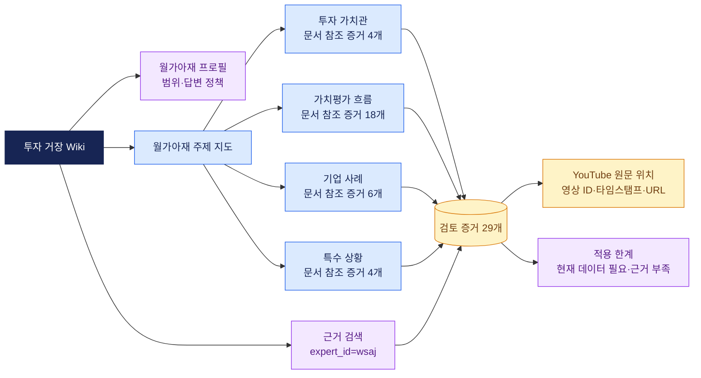
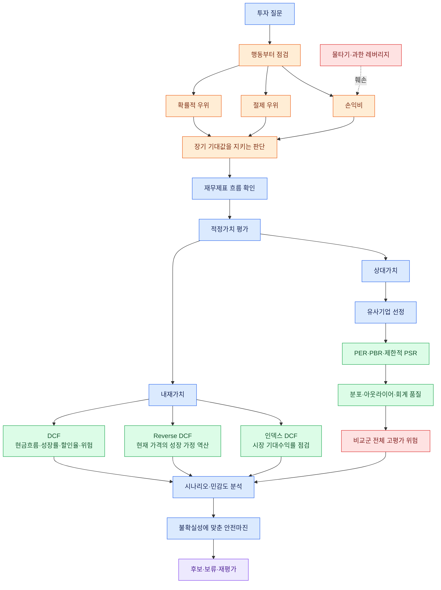
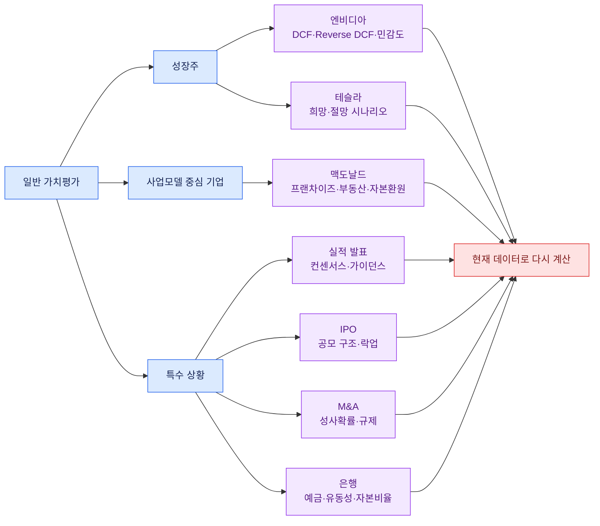

# 월가아재 투자 Wiki 그래프

이 문서는 현재 Wiki의 정보 구조와 월가아재 자료에서 확인한 투자 원칙의 연결 관계를 보여준다.
그래프의 화살표는 원문의 발언 순서가 아니라, 검토된 증거를 Wiki에서 탐색하기 위한 연결이다.

## 정보 구조

현재 구조는 `주제 문서 → 증거 ID → 원문 위치`로 내려간다.
주제 문서는 설명과 오용 위험을 제공하고, 증거 JSON은 claim 종류와 출처 위치를 보존한다.

## 현재 존재하는 층과 비어 있는 층

따라서 현재 Wiki는 월가아재의 공개 자료를 공부하고 검증하는 데 적합하다.
하지만 사용자의 위험 감수 수준, 투자 기간, 손실 허용도와 원칙 채택 여부를 기록하지 않으므로, 아직 개인 투자자의 자기 탐색 도구는 아니다.

## 투자 가치관과 가치평가의 연결

이 연결의 중심은 가격 예측이 아니라 `기대값과 행동 점검 → 가치평가 → 불확실성 조정`이다.
다만 `확률적 우위`, `절제 우위`, `손익비`를 뒷받침하는 현재 증거는 가치평가 증거보다 적다.
따라서 이 부분은 월가아재의 완결된 투자 철학이 아니라, 현재까지 승격된 근거가 보여주는 잠정 지도다.

## 사례와 예외 경로

## 근거 묶음

| 탐색 영역 | 증거 ID | 현재 읽을 문서 |
| --- | --- | --- |
| 투자 행동과 가치관 | `wsaj-evidence-000012`, `000013`, `000024`, `000026` | [투자 가치관](pages/investing-values.md) |
| 가치평가 원리와 절차 | `wsaj-evidence-000001`부터 `000014`, `000025`, `000027`부터 `000029` | [가치평가 흐름](pages/valuation-process.md) |
| 실제 기업 적용 | `wsaj-evidence-000015`부터 `000019`, `000029` | [기업 사례](pages/company-cases.md) |
| 사건별 예외 처리 | `wsaj-evidence-000020`부터 `000023` | [특수 상황](pages/special-situations.md) |

증거의 상세 claim과 원문 URL은 [evidence/core.json](evidence/core.json)에서 확인한다.
현재 종목에 적용할 때는 이 그래프만으로 매수와 매도 결론을 내리지 않고, 최신 시장 데이터와 가정 검증을 별도로 붙인다.
